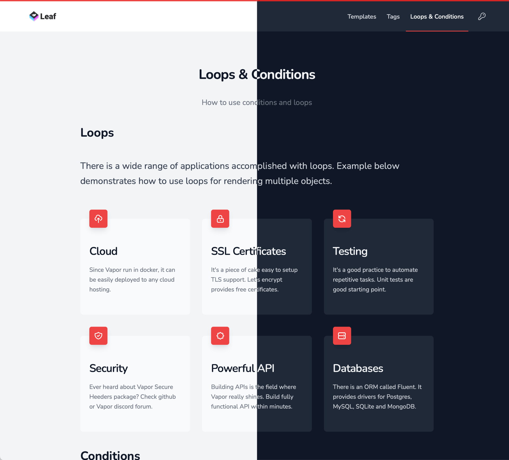

# Leaf 4 - demo website

Purpose of this website is to provide examples of Leaf templating engine as a complement to [official documentation](https://docs.vapor.codes/4.0/leaf/getting-started).

It's powered by [Vapor framework](https://vapor.codes) and obviously [Leaf](https://github.com/vapor/leaf). Native dark mode support is provided by tailwind.css.



## Prerequisites

Leaf4Demo requires Swift 5.2 or greater. It can be run in docker container as well so you don't have to install swift on your local machine.

## How to use it?

```bash
git clone https://github.com/fananek/Leaf4Demo
cd Leaf4Demo

# OPTION 1: run directly on your machine
swift run

# OPTION 2: run in a docker container
docker-compose build
docker-compose up app
```

Open [http://localhost:8080](http://localhost:8080)

## Contribution
Any good idea is welcome. :-) Eithr in form of an Issue or Pull Request.